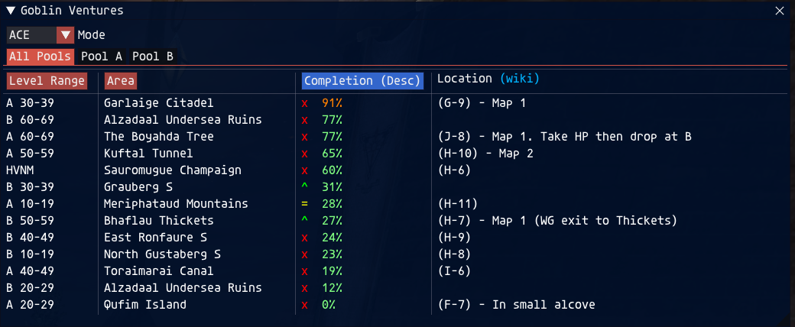
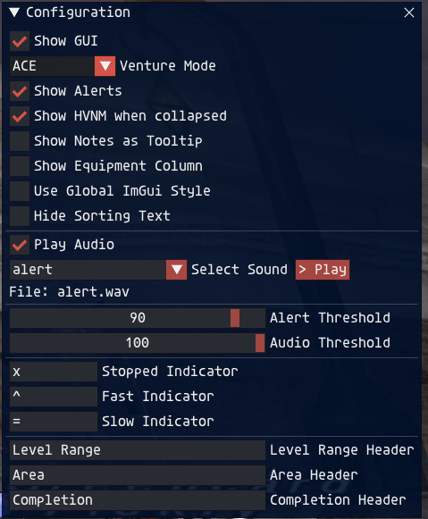

# Goblin Ventures

Ashita addon for tracking CatsEyeXI Goblin Venture areas from the server's venture info packet.

The addon listens for the incoming `0x1A3` venture packet, converts zone IDs into readable zone names, matches those zones against local or downloaded VNM metadata, and displays the current venture pools in a compact GUI.





## Features

- Parses venture data directly from packet `0x1A3`.
- Displays level range, zone, completion percentage, location, notes, and optional equipment.
- Supports ACE and CW zone views with an in-window mode selector.
- Provides pool tabs for `All Pools`, `Pool A`, and `Pool B`.
- Shows HVNM data when available.
- Alerts when a venture crosses the configured completion threshold.
- Plays an optional sound alert at a separate audio threshold.
- Tracks whether progress has recently increased with configurable row indicators.
- Downloads updated VNM metadata from GitHub on load, with a bundled fallback.
- Includes a settings window for GUI, alert, audio, sorting, label, and display options.

## Data Source

Ventures uses two kinds of data:

- Packet data from the game/server for the current ACE/CW zones and progress.
- VNM metadata from `data/vnms.lua`, such as position, equipment, element, crest, and notes.

On load, the addon tries to download:

```text
http://raw.githubusercontent.com/commandobill/ventures/main/data/vnms.lua
```

If the download succeeds and the file validates as a Lua table, it is cached as:

```text
data/vnms_remote.lua
```

The loader uses the cached remote file when available. If the remote file is missing, invalid, or cannot be downloaded, the addon falls back to the bundled:

```text
data/vnms.lua
```

## Commands

| Command | Description |
| --- | --- |
| `/ventures` | Opens or closes the configuration window. |
| `/ventures config` | Opens or closes the configuration window. |
| `/ventures settings` | Prints the current settings to chat. |
| `/ventures settings gui` | Toggles the main venture window. |
| `/ventures settings alerts` | Toggles chat alerts. |
| `/ventures settings audio` | Toggles audio alerts. |
| `/ventures settings debug` | Toggles debug mode. |
| `/ventures force` | Re-applies the current ACE/CW mode to the most recent packet. |
| `/ventures update` | Downloads the latest VNM metadata from GitHub and reloads it. |

## UI

The main window includes:

- `Mode` dropdown: switch between `ACE` and `CW`.
- Pool tabs: `All Pools`, `Pool A`, and `Pool B`.
- Sortable columns for level range, area, and completion.
- Optional equipment column.
- Location and notes display, with optional tooltip behavior.
- A collapsed title summary based on the highest visible completion.

The display updates when packet `0x1A3` arrives. Changing ACE/CW mode re-parses the most recent packet, so the zones switch immediately without waiting for a new packet.

## Configuration

The configuration window includes options for:

- Showing or hiding the main GUI.
- Selecting ACE or CW mode.
- Enabling chat alerts.
- Showing HVNM in the collapsed title.
- Showing notes as tooltips.
- Showing the optional equipment column.
- Hiding extra sorting text.
- Enabling audio alerts and selecting a sound.
- Setting chat and audio alert thresholds.
- Customizing progress indicator characters.
- Renaming the level range, area, and completion headers.

Settings are persisted with Ashita's settings system.

## Alerts

Alerts are based on completion increases. If a venture rises above the configured alert threshold, the addon prints a chat alert. If audio alerts are enabled and the venture reaches the configured audio threshold, the selected sound is played.

The alert key includes pool, level range, and area, which keeps Pool A and Pool B alerts independent.

## Files

| Path | Purpose |
| --- | --- |
| `ventures.lua` | Addon entry point, commands, packet handler, GUI render loop. |
| `services/parser.lua` | Parses packet `0x1A3` into venture model objects. |
| `services/vnm_loader.lua` | Downloads, validates, caches, and loads VNM metadata. |
| `services/config_ui.lua` | Configuration window. |
| `services/alert.lua` | Chat and audio alert handling. |
| `data/zones.lua` | Numeric zone ID to zone name lookup. |
| `data/vnms.lua` | Bundled fallback VNM metadata. |
| `data/vnms_remote.lua` | Downloaded VNM metadata cache, created at runtime. |
| `ui/window.lua` | Main venture window. |
| `ui/headers.lua` | Table headers. |
| `ui/rows.lua` | Venture table rows. |

## Notes

- This addon no longer sends `!ventures` or parses incoming text.
- The main data path is the incoming `0x1A3` packet.
- Remote VNM data is executed as Lua after validation. Only use a source you control and trust.
- Keep zone names in `data/vnms.lua` aligned exactly with `data/zones.lua` so metadata lookups work.

## Credits

Built by **Commandobill**.

Contributions by **Seekey** and **Phatty**.

Tested on private server environments. Feedback and contributions are welcome.
